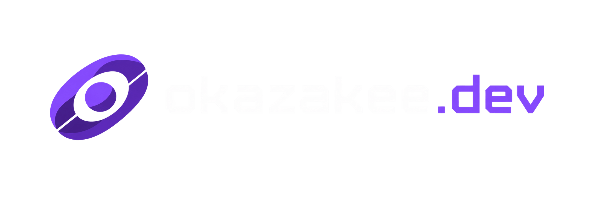

<p align="center">
  
</p>

<p align="center">
  <strong>Personal portfolio &amp; blog</strong> — bilingual, fast by design.
  <br />
  <a href="https://okazakee.dev">okazakee.dev</a> &nbsp;·&nbsp; content managed
  by the standalone <a href="https://github.com/Okazakee/okazakee-cms">okazakee-cms</a>
</p>

---

## Overview

A Next.js 16 application that renders the public face of Okazakee: hero
section, skills carousel, career timeline, portfolio projects, blog with
full-text search, and a privacy policy — all in English and Italian with
dark/light/auto theming.

This repository is deliberately **read-only for content**. It renders
published data from a shared Supabase project using Next.js Cache Components
and never edits it: all authoring happens in the standalone CMS
([Okazakee/okazakee-cms](https://github.com/Okazakee/okazakee-cms), private,
live at [cms.okazakee.dev](https://cms.okazakee.dev)), which invalidates
public caches through a signed revalidation endpoint
(`POST /api/internal/content-revalidate`).

## Highlights

- **Bilingual routing** — EN/IT via `next-intl`, locale-aware
  `/[locale]/[post_type]/[id]/[title]` URLs
- **Theming** — dark / light / auto with a flash-free bootstrap script
- **Search** — portfolio and blog content with a debounced search action
- **View tracking** — per-post counters backed by Supabase RPCs
- **Cache invalidation** — HMAC-signed, replay-protected revalidation events
  from the CMS (`cacheTag` / `cacheLife`, `revalidateTag(tag, 'max')`)
- **Performance** — Server Components for data and SEO, client islands only
  where interactivity demands it; WebP-only image pipeline
- **Quality** — TypeScript strict mode, Biome formatting/linting, Vitest
  suites, CI on every pull request

## Tech Stack

| Layer | Choice |
| --- | --- |
| Framework | Next.js 16 (App Router, Turbopack) |
| Language | TypeScript (strict) |
| Styling | Tailwind CSS 4 · Lucide icons |
| Data | Supabase (PostgreSQL · Storage · RPCs) — read-only, publishable key |
| i18n | next-intl (EN/IT) |
| State | Zustand (theme store) |
| Quality | Biome · Vitest · GitHub Actions |
| Hosting | Vercel |

## Architecture

```text
              writes              reads
okazakee-cms ───────▶ Supabase ◀──────── okazakee-ws (this repo)
     │                                       │
     └── signed content-change event ───────▶ POST /api/internal/content-revalidate
```

- **Routing:** `/[locale]/[post_type]/[id]/[title]` with i18n; legacy
  `/{locale}/cms*` URLs 307-redirect to the standalone CMS.
- **Components:** Server Components for data and metadata; Client Components
  for interactivity (menu, theme, search).
- **Supabase:** one stateless client with the publishable key for reads and
  RPCs (view counters). No elevated credentials live in this repository.
- **Caching:** public reads use `cacheTag`/`cacheLife` with the vocabulary in
  `src/libs/content/cacheTags.ts`. The signed revalidation endpoint accepts
  content-change events from the CMS (HMAC-SHA256, replay window, hard-coded
  tag allowlist) and calls `revalidateTag(tag, 'max')`.
- **i18n:** translations are stored in the Supabase `i18n_translations` table
  and served through `getTranslationsSupabase` (server) or `next-intl`
  clients (browser). Edited from the CMS, rendered here.

## Getting Started

### Prerequisites

- Bun 1.3+ (`packageManager: "bun@1.3.7"`)
- A Supabase project — the content schema is owned by the CMS repository; the
  public site only reads it

### Install

```bash
git clone https://github.com/Okazakee/okazakee-ws.git
cd okazakee-ws
bun install
cp .env.local.example .env.local   # then fill in the values below
bun run dev
```

### Environment

**Required**

| Variable | Purpose |
| --- | --- |
| `NEXT_PUBLIC_SUPABASE_URL` | Supabase project URL (project settings) |
| `NEXT_PUBLIC_SUPABASE_PUBLISHABLE_KEY` | Publishable key (`sb_publishable_…`) — never a secret/service key |
| `DOMAIN_URL` | Production domain, e.g. `https://okazakee.dev` |

**Optional**

| Variable | Purpose |
| --- | --- |
| `APP_ENV` | `production` \| `staging` \| `development`; controls cache defaults and publish-date enforcement |
| `CONTENT_ENFORCE_PUBLISH_DATE` | Hide future-dated posts (`true`/`false`; default: production builds only) |
| `NEXT_PUBLIC_SITE_URL` | Site URL for metadata/OG images; set on Vercel |
| `NEXT_PUBLIC_CMS_URL` | Standalone CMS origin (footer "CMS" link; falls back to the legacy path, which the Proxy redirects) |
| `LEGACY_CMS_REDIRECT_HOST` | When set, legacy `/{locale}/cms*` URLs 307-redirect to the standalone CMS host |
| `CONTENT_REVALIDATION_SECRET` | Shared secret authenticating content-change events from the CMS |
| `UMAMI_ENABLED` | Enable Umami analytics (`true`/`false`) |
| `ISR_REVALIDATION` | Cache lifetime in seconds (content caches + GitHub stars fetch); default `86400` in production, `600` otherwise |
| `NEXT_PUBLIC_LOCALES` | Comma-separated locales (default `en,it`) |
| `NEXT_PUBLIC_DEFAULT_LOCALE` | Default locale (default `en`) |

### Scripts

```bash
bun run dev       # Development server (Turbopack)
bun run build     # Production build
bun run start     # Production server
bun run lint      # Biome lint
bun run lint-fix  # Biome lint + autofix
bun run format    # Biome format
bun run test      # Vitest test suite
```

## Deployment

1. Build locally to verify: `bun run build`
2. Configure environment variables on the platform (Vercel: Project Settings
   → Environment Variables)
3. Ensure the Supabase project exposes the public schema (owned by the CMS
   repo), the view-counter RPCs (`increment_blog_post_views_bigint`,
   `increment_portfolio_post_views_bigint`) and the `website` storage bucket
   with public read policies
4. Deploy (Vercel: push to `master`/`beta` or trigger a manual deployment)

**Vercel preset:** Framework Next.js, build command `bun run build`, output
`.next`.

**Recommended cache setup:** set `ISR_REVALIDATION=86400` on production and
`600` on the beta preview branch (branch-scoped env).

## Testing & CI

- **Unit tests:** `bun run test` (Vitest, `src/**/*.test.ts`) — covers the
  cache-tag vocabulary, the signed revalidation contract, and routing rules.
- **CI** (`.github/workflows/ci.yml`, on `master`/`beta` and pull requests):
  install → lint → test → build → typecheck. Build runs before typecheck
  because a fresh checkout needs `.next/types` for route and image module
  resolution.

## Troubleshooting

| Symptom | Fix |
| --- | --- |
| Build errors | Check environment variables, Node/Bun version, clear `.next` |
| Cache not updating | Verify `WEBSITE_REVALIDATION_SECRET` (CMS) equals `CONTENT_REVALIDATION_SECRET` (this repo); inspect CMS logs for `[revalidation]` failures |
| Missing content | Ensure tables exist (schema owned by the CMS repo) and RLS allows public reads |
| Images not loading | Check the `website` storage bucket, policies, file size limits |
| Translations missing | Verify `i18n_translations` in Supabase (managed from the CMS) |

## License

[MIT](LICENSE)
